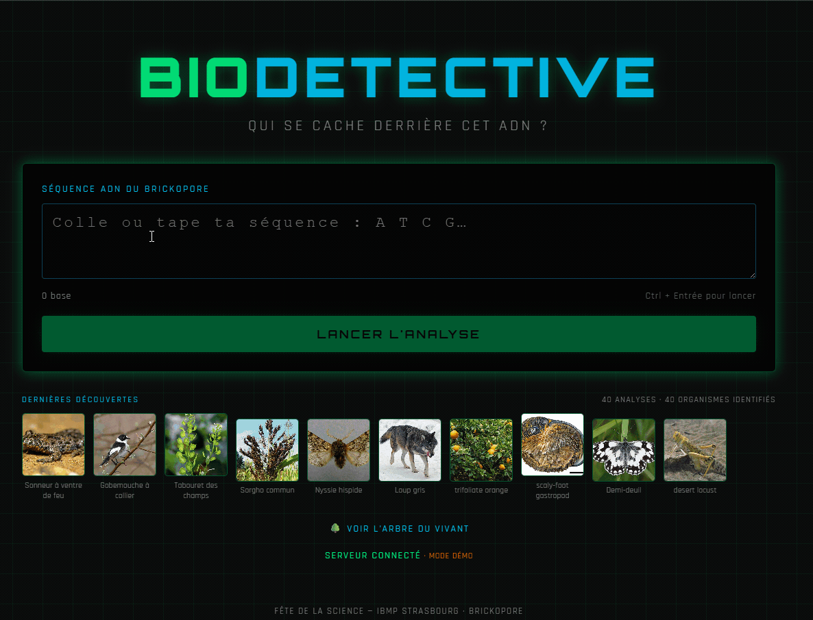
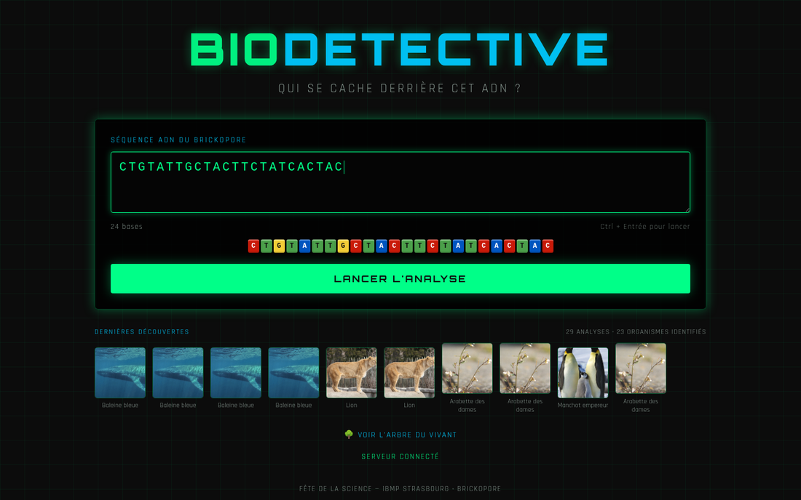
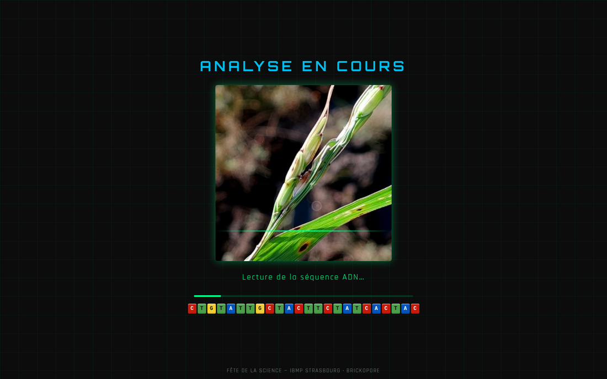
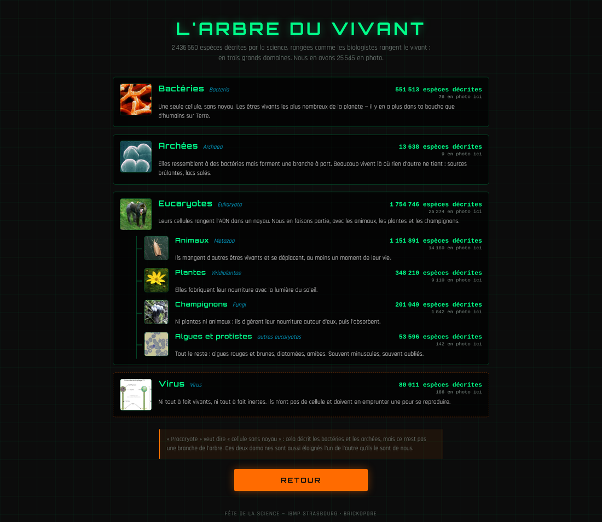

# BioDetective

**Identifier un organisme à partir d'une séquence ADN assemblée en briques LEGO et séquencée via le Brickopore**

Une application web de médiation scientifique conçue pour la Fête de la Science. 
Le grand public assemble une séquence ADN representée par des briques de LEGOs, qui vont ensuite être identifié par le séquenceur
[**Brickopore**](https://brickopore.co.uk/). La séquence est ensuite saisit dans l'application et elle identifie quel être vivant se
cachait derrière avec sa photo, l'alignement, la position du hit sur son chromosome et sa parenté.



---

## Recherche par BLAST 

L'identification passe par un **vrai `blastn`**, en local, contre une banque
construite à partir de `nt` et restreinte aux 25 545 espèces dont nous possédons
une photographie. Pas de table de correspondance déguisée : la E-value, le
pourcentage d'identité et l'alignement affichés sont ceux que rend BLAST, et le
rapport brut est consultable d'un clic depuis l'écran de résultat.

Si restriction de place, nous simulons la recherche BLAST et affichons un organisme au hasard. 

## Les interfaces

| | |
|---|---|
|  | **Accueil** — la séquence s'affiche en briques colorées à mesure qu'on la tape, aux teintes LEGO réelles du Brickopore. |
|  | **Recherche** — des organismes défilent à 12 images par seconde pendant que BLAST travaille. La durée est tirée au sort entre 2,5 et 13 s, indépendamment du résultat. |
|  | **L'arbre du vivant** — Les effectifs réels du taxdump NCBI |

---

## Installation

```bash
# Dépendances
pip install -r requirements.txt
npm install
conda install -c bioconda blast

# Données NCBI : télécharger et décompresser new_taxdump.tar.gz dans new_taxdump/
python3 data_pipeline.py        # -> biodetective.db, 25 545 organismes
python3 build_genome_stats.py --download   # taille des génomes, chromosomes
python3 build_tree_stats.py     # effectifs par grand groupe
python3 make_montages.py        # planches de l'écran de recherche

# Banque BLAST, avec nt disponible localement
blastdb_aliastool -db nt -taxidlist taxids.txt -dbtype nucl \
                  -out blastdb/biodetective -title BioDetective
python3 make_strips.py --length 24
python3 validate_sequences.py   # à relancer le matin de la démo
```

## Lancement

```bash
npm run build
python3 api.py        # tout sur http://localhost:8000
```

FastAPI sert lui-même le frontend compilé : un seul processus, un seul port,
aucun proxy. `Ctrl+C` pour arrêter.

En développement, `npm start` ajoute le rechargement à chaud sur le port 3000.

---

## Sous le capot

- **Backend** — Python 3.9, FastAPI, SQLite. Analyse asynchrone avec
  interrogation périodique : l'attente est la mise en scène.
- **Frontend** — React 18, CSS pur, aucune bibliothèque de composants ni de
  graphiques. L'idéogramme et l'arbre sont du SVG et du CSS écrits à la main.
- **Données** — NCBI Taxonomy (`new_taxdump`), images Wikimedia et iNaturalist
  via NCBI, tailles de génomes depuis `GENOME_REPORTS`.
- **Traçabilité** — chaque analyse dépose dans `blast_results/` la commande
  exacte, le tableau lu par l'application et le rapport `blastn` complet.

Le détail des choix, des mesures et des pièges rencontrés est dans
[`CLAUDE.md`](CLAUDE.md).

---

## Crédits

Développé pour la Fête de la Science par David Pflieger, IBMP Strasbourg.
Les photographies proviennent de Wikimedia Commons et d'iNaturalist ; leur
licence et leur auteur sont affichés au survol de chaque image.
