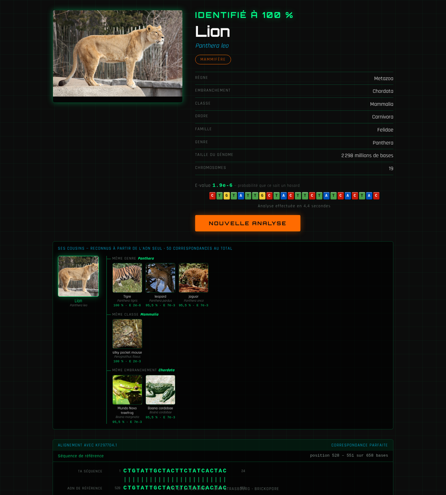

# BioDetective

**Identifier un organisme à partir d'une séquence ADN assemblée en briques LEGO.**

Une application de médiation scientifique conçue pour la Fête de la Science à
l'[IBMP](https://ibmp.cnrs.fr/) (Institut de biologie moléculaire des plantes,
Strasbourg). Un enfant assemble une séquence ADN avec le séquenceur LEGO
**Brickopore**, la saisit dans l'application, et découvre quel être vivant se
cachait derrière — avec sa photo, l'alignement, la position du hit sur son
chromosome et sa parenté.



---

## Ce n'est pas un tour de passe-passe

L'identification passe par un **vrai `blastn`**, en local, contre une banque
construite à partir de `nt` et restreinte aux 25 545 espèces dont nous possédons
une photographie. Pas de table de correspondance déguisée : la E-value, le
pourcentage d'identité et l'alignement affichés sont ceux que rend BLAST, et le
rapport brut est consultable d'un clic depuis l'écran de résultat.

### Pourquoi une banque restreinte, et pas `nt` entier

Les brins du Brickopore font 24 bases. Contre `nt` (~10¹² lettres), une requête
aussi courte ne donne rien d'exploitable ; contre une banque de quelques dizaines
de mégabases, elle est nette. Mesuré sur base simulée :

| Longueur du brin | Meilleur hit | E-value |
|---|---|---|
| 12 briques | une espèce au hasard | 1,6 |
| 16 briques | la bonne | 0,010 |
| **24 briques** | la bonne | **5,4 × 10⁻⁷** |

Restreindre la banque n'est pas qu'une économie de place, c'est ce qui rend la
réponse **juste** : contre `core_nt`, le brin « Lion » sort *Panthera pardus*, le
léopard, parce que 24 bases de COI sont partagées par tout le genre.

Bénéfice inattendu : une brique mal comptée sur 24 retrouve quand même le bon
organisme, à 95,8 % d'identité. C'était le principal risque de la démonstration.

---

## Les écrans

| | |
|---|---|
|  | **Accueil** — la séquence s'affiche en briques colorées à mesure qu'on la tape, aux teintes LEGO réelles du Brickopore. |
|  | **Recherche** — des organismes défilent à 12 images par seconde pendant que BLAST travaille. La durée est tirée au sort entre 2,5 et 13 s, indépendamment du résultat. |
|  | **L'arbre du vivant** — trois domaines, les effectifs réels du taxdump NCBI, et notre collection en regard. 551 513 bactéries décrites, 76 en photo. |

L'écran **« séquence inconnue »** est traité comme un aboutissement, pas comme
une panne : les enfants assemblent les briques librement, c'est donc le plus vu
de la journée.

---

## Installation

```bash
# Dépendances
pip install -r requirements.txt
npm install
conda install -c bioconda blast

# Données NCBI : télécharger et décompresser new_taxdump.tar.gz dans new_taxdump/
python3 data_pipeline.py        # -> biodetective.db, 25 545 organismes
python3 build_genome_stats.py --download   # taille des génomes, chromosomes
python3 build_tree_stats.py     # effectifs par grand groupe
python3 make_montages.py        # planches de l'écran de recherche

# Banque BLAST, avec nt disponible localement
blastdb_aliastool -db nt -taxidlist taxids.txt -dbtype nucl \
                  -out blastdb/biodetective -title BioDetective
python3 make_strips.py --length 24
python3 validate_sequences.py   # à relancer le matin de la démo
```

## Lancement

```bash
npm run build
python3 api.py        # tout sur http://localhost:8000
```

FastAPI sert lui-même le frontend compilé : un seul processus, un seul port,
aucun proxy. `Ctrl+C` pour arrêter.

En développement, `npm start` ajoute le rechargement à chaud sur le port 3000.

---

## Sous le capot

- **Backend** — Python 3.9, FastAPI, SQLite. Analyse asynchrone avec
  interrogation périodique : l'attente est la mise en scène.
- **Frontend** — React 18, CSS pur, aucune bibliothèque de composants ni de
  graphiques. L'idéogramme et l'arbre sont du SVG et du CSS écrits à la main.
- **Données** — NCBI Taxonomy (`new_taxdump`), images Wikimedia et iNaturalist
  via NCBI, tailles de génomes depuis `GENOME_REPORTS`.
- **Traçabilité** — chaque analyse dépose dans `blast_results/` la commande
  exacte, le tableau lu par l'application et le rapport `blastn` complet.

Le détail des choix, des mesures et des pièges rencontrés est dans
[`CLAUDE.md`](CLAUDE.md).

---

## Crédits

Développé pour la Fête de la Science par David Pflieger, IBMP Strasbourg.
Les photographies proviennent de Wikimedia Commons et d'iNaturalist ; leur
licence et leur auteur sont affichés au survol de chaque image.
